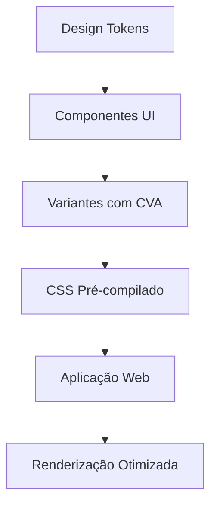

# Arquitetura do Design System Shadcn (CSS Pré-compilado)

## Introdução

Nossa arquitetura evolui para um design system com foco em componentes pré-compilados, CSS auto-suficiente e experiência de desenvolvimento simplificada.

## Princípios Arquiteturais Fundamentais

### 🔧 Modularidade
- Componentes totalmente independentes
- CSS pré-compilado embutido
- Zero configuração para consumidores

### 🎨 Configurabilidade
- Design baseado em tokens
- Suporte a variantes via `cva`
- Temas globais via variáveis CSS

### 🚀 Performance
- CSS gerado em build time
- Remoção de estilos não utilizados
- Renderização otimizada

## Topologia Atualizada do Sistema

### Camadas Principais

1. **UI Package (`packages/ui`)**
   - 💡 Componentes reutilizáveis
   - 🎨 Tokens de design centralizados
   - 📦 CSS pré-compilado

2. **Web App (`apps/web`)**
   - 🖼️ Consumo de componentes
   - 🔗 Import único de CSS
   - 🧩 Composição de UI

## Abordagem de CSS Pré-compilado

### Estrutura de Diretórios

```
packages/ui/
├── src/
│   ├── styles/
│   │   ├── tokens.css       # Variáveis globais
│   │   └── index.css        # Configuração Tailwind
│   └── components/
└── dist/
    ├── styles.css           # CSS final
    └── components/          # Componentes compilados
```

### Geração de Variantes

```typescript
const buttonVariants = cva("base-styles", {
  variants: {
    variant: {
      primary: "bg-primary text-white",
      secondary: "bg-secondary text-gray-800"
    },
    size: {
      sm: "text-sm px-2",
      md: "text-base px-4"
    }
  }
})
```

### Benefícios da Nova Abordagem

- ✅ CSS totalmente pré-compilado
- ✅ Zero configuração para consumidores
- ✅ Performance de renderização
- ✅ Consistência de design

## Consumo Simplificado

```typescript
// Importação única
import "@juscash/ui/styles.css"
import { Button } from "@juscash/ui"

function App() {
  return <Button variant="primary">Clique aqui</Button>
}
```

## Configuração de Biblioteca

### Ferramentas Principais

- 🌈 **Tailwind CSS**: Sistema de design
- 🎛️ **class-variance-authority (cva)**: Variantes
- 🔍 **React.forwardRef**: Referências
- 🛡️ **TypeScript**: Tipagem forte

## Decisões de Arquitetura

| Decisão | Motivação | Trade-offs |
|---------|-----------|------------|
| CSS Pré-compilado | Simplicidade, Performance | Menos flexibilidade runtime |
| Variantes com CVA | Tipagem, Manutenção | Overhead de build |
| Tokens Centralizados | Consistência visual | Menos personalização local |

## Riscos e Considerações

- 🚨 Complexidade de manutenção de variantes
- 🏗️ Dependência de ferramentas específicas
- 🔄 Necessidade de atualização constante

## Próximos Passos

- [ ] Automatizar geração de documentação
- [ ] Implementar temas dinâmicos
- [ ] Melhorar performance de build
- [ ] Adicionar mais componentes

## Diagrama de Fluxo



## Conclusão

A versão 2.1 representa um salto significativo na nossa abordagem de design system, priorizando simplicidade, performance e experiência do desenvolvedor.