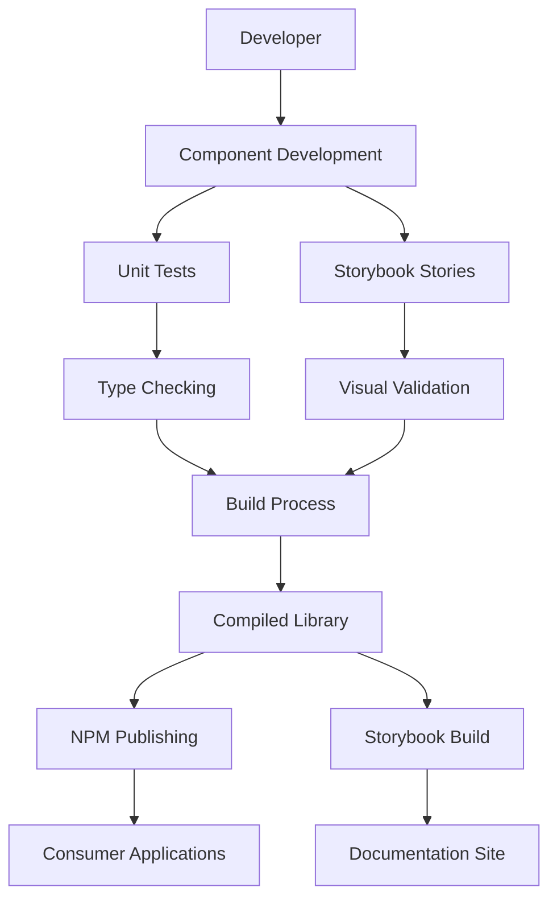

## Architecture Notes

This repository implements a modern UI component library architecture using TypeScript, React, and Tailwind CSS. The system is designed as a publishable package with comprehensive documentation and testing infrastructure.

## System Architecture Overview

The project follows a **single-package library architecture** with a focus on component reusability and developer experience. The system consists of:

1. **Core UI Package** (`packages/ui`) - Main deliverable containing components, utilities, and styles
2. **Documentation System** (Storybook) - Interactive component documentation and development environment
3. **Build Infrastructure** - Tooling for compilation, bundling, and distribution

The architecture prioritizes **component isolation**, **type safety**, and **zero-configuration consumption**. Storybook serves as both documentation and primary development environment, eliminating the need for a separate demo application.

## Architectural Layers

- **Components**: `packages/ui/src/components` - Reusable UI components with TypeScript interfaces
  - Primary responsibility: UI rendering and user interaction
  - Dependencies: Utils, Styles, and external React libraries
  - Example: `Button` component with variants and accessibility features

- **Utils**: `packages/ui/src/lib` - Shared utilities and helper functions  
  - Primary responsibility: Common functionality used across components
  - Dependencies: Minimal, only essential external packages
  - Example: `cn` utility for class name composition using clsx and tailwind-merge

- **Styles**: `packages/ui/src/styles` - Design tokens and compiled CSS
  - Primary responsibility: Visual design system and theme definition
  - Dependencies: Tailwind CSS configuration and custom tokens
  - Output: Compiled CSS bundle for distribution

> See [`codebase-map.json`](./codebase-map.json) for complete symbol counts and dependency graphs.

## Detected Design Patterns

| Pattern | Confidence | Locations | Description |
|---------|------------|-----------|-------------|
| Component Composition | 95% | `packages/ui/src/components/**` | Components compose smaller elements and utilities |
| Variant-Based Design | 90% | `button.tsx` with `ButtonProps` | Using prop-driven variants for UI flexibility |
| Utility-First CSS | 85% | `styles/tokens.css`, `tailwind.config.ts` | Tailwind CSS for consistent styling |
| Class Name Composition | 80% | `utils.ts` (`cn` function) | Merging conditional class names efficiently |
| Stories-Driven Development | 75% | `*.stories.tsx` files | Component behavior documented via Storybook |

## Entry Points

- **Library Entry**: [`packages/ui/src/index.ts`](../packages/ui/src/index.ts) - Main package exports
- **Component Index**: [`packages/ui/src/components/index.ts`](../packages/ui/src/components/index.ts) - Component exports
- **Storybook Development**: `.storybook/main.ts` - Development server configuration
- **Build Output**: [`packages/ui/dist/`](../packages/ui/dist/) - Compiled distribution files

## Public API

| Symbol | Type | Location |
|---------|-------|----------|
| `ButtonProps` | Interface | [`packages/ui/src/components/button/button.tsx:37`](../packages/ui/src/components/button/button.tsx:37) |
| `cn` | Function | [`packages/ui/src/lib/utils.ts:4`](../packages/ui/src/lib/utils.ts:4) |

## Internal System Boundaries

The library maintains clear boundaries between:
- **Component Layer** and **Utility Layer**: Components can import from utils, but not vice versa
- **Public API** and **Internal Implementation**: Only explicitly exported symbols are available to consumers
- **Style Layer** and **Component Logic**: CSS tokens are defined separately from component behavior

## External Service Dependencies

- **NPM Registry**: GitHub Packages for distribution
- **Tailwind CDN**: For consumers who don't use build tools
- **Static Hosting**: Storybook documentation can be deployed to any static hosting service

## Key Decisions & Trade-offs

| Decision | Rationale | Trade-offs |
|-----------|------------|------------|
| Storybook-Only Documentation | Simplified development workflow, no demo app maintenance | Less realistic integration testing |
| TypeScript Strict Mode | Better type safety, developer experience | Higher initial learning curve |
| Tailwind Utility-First | Consistent design system, rapid development | Larger CSS bundle size |
| Class Variance Authority | Type-safe variants, maintainable | Additional build complexity |
| Changeset Versioning | Automated releases, changelog generation | Extra dependency, learning overhead |

## Diagrams

## Risks & Constraints

- **Bundle Size**: Tailwind CSS may include unused utilities in production
- **Browser Compatibility**: Requires modern browsers supporting CSS custom properties
- **Development Environment**: Storybook dependency increases initial setup time
- **Version Management**: Coordinating releases between components and utilities

## Top Directories Snapshot

- `packages/ui/src/` - Component and utility source code (10+ files)
- `packages/ui/dist/` - Compiled distribution files (20+ files)  
- `.storybook/` - Storybook configuration (2 files)
- `storybook-static/` - Built documentation (60+ files)
- `docs/` - Project documentation (12 files)

## Related Resources

- [project-overview.md](./project-overview.md)
- [data-flow.md](./data-flow.md)
- [codebase-map.json](./codebase-map.json)